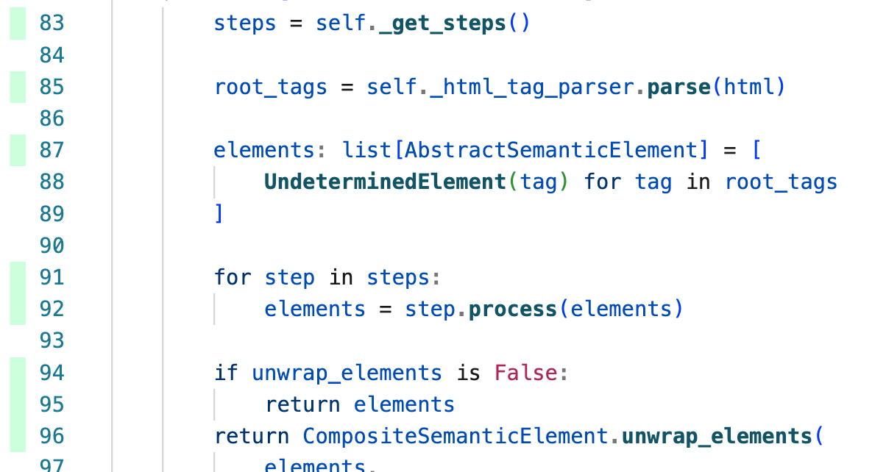

# Common Contributing Guide

Welcome to the centralized contributing guidelines repository for select Alphanome-AI projects. This resource is designed to provide developers with all the information they need to contribute effectively to our projects, such as environment setup, coding standards, and contribution workflows. 

These guidelines are specifically pointed to by the `CONTRIBUTING.md` files of the projects [sec-parser](https://github.com/alphanome-ai/sec-parser/blob/main/CONTRIBUTING.md) and [sec-ai](https://github.com/alphanome-ai/sec-ai/blob/main/CONTRIBUTING.md).

## Table of Contents
- [Welcome to the Quick Start Guide!](#welcome-to-the-quick-start-guide)
- [Contribution Workflow](#contribution-workflow)
- [Development Environment Setup](#development-environment-setup)
- [Coding Standards](#coding-standards)
- [Questions and Help Requests](#questions-and-help-requests)

## Welcome to the Quick Start Guide!

We understand that you're eager to start contributing to our projects. So, we've prepared a brief guide to get you up and running as quickly as possible. Let's dive right in!

1. **Setting up Poetry**: We prefer Poetry over pip for managing dependencies. It's easy to install on your system. Just follow the instructions provided [here](https://python-poetry.org/). Or, you can use the command below:

```bash
curl -sSL https://install.python-poetry.org | python3 -
```

2. **Installing Project Dependencies**: Once you've got Poetry installed, it's time to get the project dependencies. Navigate to the project directory and use the following command:

```bash
poetry install
```

3. **Getting Task Ready**: Task is our go-to tool for task management. It's a simple and efficient alternative to Make, written in Go. You can install it by following the instructions [here](https://taskfile.dev/#/installation).

4. **Exploring Common Operations**: We've made several common operations available as tasks for your convenience. You can view the most commonly used ones with the command below:

```bash
task --list
```

**Congratulations!** You're now ready to start contributing. We're excited to have you join us and look forward to the valuable contributions you'll make.

For a more comprehensive understanding of our contribution workflow and development environment setup, continue reading.

## Contribution Workflow

We're delighted that you're considering contributing to our project! To assist you in getting started, we've outlined a recommended workflow below. However, feel free to adapt this process to suit your preferred approach.

1. Start by navigating to the GitHub issues page of the project you wish to contribute to (for example, [sec-parser GitHub issues](https://github.com/alphanome-ai/sec-parser/issues)). We recommend beginning with issues labeled `contributions-welcome`, as these are typically in line with our [roadmap](https://github.com/orgs/alphanome-ai/discussions/categories/roadmap-future-plans). If you're new to contributing, consider starting with issues tagged `good-first-issue`. We also welcome new improvement suggestions or bug fixes, especially those that align with our roadmap.
2. Fork the project to create your own copy where you can make changes.
3. Although optional, we highly recommend discussing your approach to the issue in the issue thread. This is a great place to ask questions or seek help, and it also helps avoid duplicate efforts. Remember, we're a community and we're here to support each other!
4. Clone your forked project to your local machine.
5. We strongly recommend that you regularly upload your code to a draft PR. This allows others to see your progress and offer assistance if necessary. To also ensures that you're working with the most recent changes from the main branch, follow the instructions provided in this [GitHub guide](https://docs.github.com/en/pull-requests/collaborating-with-pull-requests/working-with-forks/syncing-a-fork#syncing-a-fork-branch-with-the-github-cli).
6. Our CI/CD pipeline will run `task ci-checks` every time you push to your PR, notifying you of any issues. You can also run `task ci-checks` locally before pushing to catch any potential problems early.
7. Lastly, take a moment to appreciate your contribution! Together, we're building something truly remarkable, and we're very grateful for your involvement.

## Development Environment Setup

### Supported Operating Systems

Our development environment is optimized for Linux and macOS. If you're using these operating systems, the setup should be straightforward. For Windows users, we recommend setting up the Windows Subsystem for Linux (WSL) and using the "Opening a WSL 2 folder in a container" method as outlined in the [VS Code documentation](https://code.visualstudio.com/docs/remote/wsl). Please be aware that we officially support only Linux and macOS. Windows users may need to troubleshoot independently.

### Installing Poetry

For managing dependencies in our projects, we prefer using Poetry over pip. Poetry is a robust tool for package management in Python applications. It allows you to declare the libraries your project relies on, and it takes care of installing and updating them for you. You can read more about Poetry [here](https://python-poetry.org/).

To get started with Poetry, you first need to install it. You can do this by running the following command:

```bash
curl -sSL https://install.python-poetry.org | python3 -
```

Once you've installed Poetry, you can confirm that the installation was successful by checking its version. Run the following command to do this:

```bash
poetry --version
```

Now that you have Poetry installed, you can use it to install the dependencies for this project. Navigate to the project directory and run the following command:

```bash
poetry install
```

This command will install all the necessary dependencies for the project.

> **Note**
To execute a command within the context of the project, use `poetry run`. This ensures that the command is executed with the virtual environment activated and with all the dependencies available. For instance, if you want to run a Python script in the project, you would use the following command: `poetry run python your_script.py`. This command will execute `your_script.py` using the Python interpreter in the project's virtual environment.


### Installing Task

In our projects, we utilize `Task` for task management. `Task` is a flexible and straightforward tool that allows us to define and run the tasks with ease. You can learn more about `Task` [here](https://taskfile.dev/).

To start using Task, you first need to install it. You can do this by following the instructions provided on the [Task installation page](https://taskfile.dev/installation/).


### Confirming Installation of Poetry and Task

Once you have `Task` installed, you can confirm that both `Task` and Poetry are functioning correctly by running the project's unit tests. To do this, navigate to the project directory and execute the following command:

```bash
task unit-tests
```

This command will initiate the unit tests for the project. If all tests pass successfully, it indicates that both `Task` and Poetry are properly set up.

### Managing Tasks with Task

To view the most commonly used tasks that you can execute with Task, navigate to the project directory and execute the following command:

```bash
task --list
```

This command will display a list of the most commonly used tasks. Here's an example of what you might see:

```text
$ task --list
task: Available tasks for this project:
* ci-checks:                    Execute all CI/CD checks for debugging a failing CI/CD pipeline.
* e2e-generate-dataset:         Create end-to-end dataset snapshots using the latest parser outputs.
* e2e-verify-dataset:           Validate the end-to-end dataset snapshots against the latest parser outputs.
* launch-debug-dashboard:       Start a local debugging dashboard in the browser.
* launch-docs:                  Start a local server to preview and automatically rebuild documentation upon file modification.
* monitor-unit-tests:           Run unit tests and rerun them immediately upon file modification.
* pre-commit-checks:            Execute all pre-commit checks before committing code.
* pre-push-checks:              Execute all pre-push checks before pushing code or creating a PR.
```

To view all the tasks and their descriptions that you can execute with Task, you can open the `Taskfile.yml file located at the root of the project.

### Recommended IDE

In order to maximize your productivity and efficiency when contributing to our codebase, we highly recommend using Cursor as your Integrated Development Environment (IDE). Cursor is a powerful, AI-enhanced fork of VSCode that is designed to streamline the coding process. It's not just about writing code, but writing it well and quickly.

Our codebase is rich with docstrings, type hints, and has a high unit test coverage. These features are leveraged by Cursor's AI capabilities (with ChatGPT), to provide intelligent code completions, error detection, and other helpful suggestions. This means you can write code faster, with fewer errors, and spend less time debugging.

Cursor is free to use and retains all the features you love about VSCode, but with the added benefit of AI integration. This makes it an ideal choice for working on our projects. You can read more about Cursor and download it from [here](https://cursor.sh/).

> **Note**
For optimal performance, we recommend using OpenAI's GPT-4 model.

> **Note**
Cursor Free allows you to use unlimited AI features at no cost when you provide your own API key. You can generate your own API key at [OpenAI's API key page](https://platform.openai.com/account/api-keys) and add it to your Cursor settings for optimal performance.

### Using Pre-commit (Optional)

Pre-commit is a tool that integrates with Git to automatically run various code checks, including unit tests, before each commit. This ensures that all modifications are validated before they are committed.

This tool is already installed as a package dependency during the `poetry install` command. To activate it for your project, run the following command:

```bash
pre-commit install
```

Once activated, pre-commit will run the code checks automatically with each commit. Any issues detected must be addressed before you can commit your changes.  some issues will be auto-fixed otherweise let you know if somthing is not right

## Coding Standards

The pre-commit tool you've installed is designed to perform a series of checks with each commit you make. These checks are mirrored in our CI/CD pipeline and must pass before any PR can be merged. This process ensures the quality and consistency of our code across the entire project. Remember, you have the flexibility to run these checks individually or all at once using `Task`.

### Code Formatting

We use `Ruff` for Python linting due to its speed and extensive rule set. It consolidates the functionality of multiple tools, supports automatic error correction, and is trusted by major open-source projects. For more details, refer to the [Ruff Documentation](https://ruff.dev/docs).

> **Note**
[Cursor](https://cursor.sh/) AI could be a helpful resource in addressing lint issues. However, it's important to review and confirm the AI's recommendations to ensure they are suitable and meet the intended purpose, rather than blindly applying them.

### Type Hints

We use type hints in our code to make it more readable and maintainable. They help catch certain types of errors early and allow IDEs to provide better code completion. For a quick introduction and further reading, visit [Real Python's guide on type hinting](https://realpython.com/lessons/type-hinting/).

> **Note**
[Cursor](https://cursor.sh/) AI can assist in transforming untyped code into typed code within your project. However, it's crucial to review and verify the AI's output for accuracy, rather than applying it blindly.

### Unit Tests

Unit tests are essential for verifying the functionality of code under various inputs and conditions. They aid in early bug detection and ensure safer refactoring. While writing tests, the focus is on functionality rather than cleanliness, hence code quality checks are not enforced on test code. This approach enhances productivity. For more information on Python testing, refer to [Real Python's guide](https://realpython.com/python-testing/).

> **Note**
Consider using [Cursor](https://cursor.sh/) AI to facilitate your unit test writing process. However, remember that the purpose of unit tests is not just to "cover" your code. Unit tests establish a specification of the expected behavior of correctly written code under a variety of circumstances, isolated from other pieces of code.

> **Note**
We recommend [Coverage Gutters](https://marketplace.visualstudio.com/items?itemName=ryanluker.vscode-coverage-gutters) for VSCode/Cursor users. This extension integrates with the project automatically and displays line coverage. It provides a visual representation of the code that has been executed at least once during unit test checks. Here is an example of how Coverage Gutters displays line coverage:<br><br>&nbsp;<br>&nbsp;

### Conventional Commits (Optional)

We encourage the use of conventional commits for your contributions. Conventional commits provide a structured format for commit messages, making them more readable and easy to automate. For more details, refer to the [Conventional Commits specification](https://www.conventionalcommits.org/).

> **Note**
[Cursor](https://cursor.sh/) AI can assist in structuring your commit messages. However, remember that the purpose of commits is to state **why** you're making a change, not what the change is. For example, a commit message like "Refactor serialization logic to improve performance" is much more informative than just "Update serialization".

## Contact and Support
Should you have any questions, concerns, or need further clarification, please post them to our [Discussions](https://github.com/orgs/alphanome-ai/discussions) page unless they are specific to a GitHub issue or a GitHub pull request. This centralized area allows for easier tracking of community inquiries and ensures that you get a timely response.

## Conclusion
Thank you for your interest in contributing to our projects! We're thrilled to have you on board. Your contributions help make our projects better, and we sincerely appreciate your time and effort.

Happy coding!
